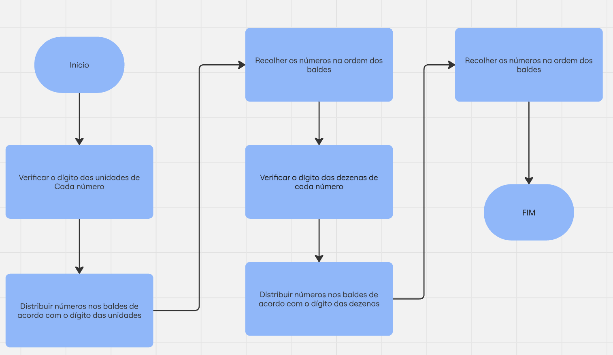
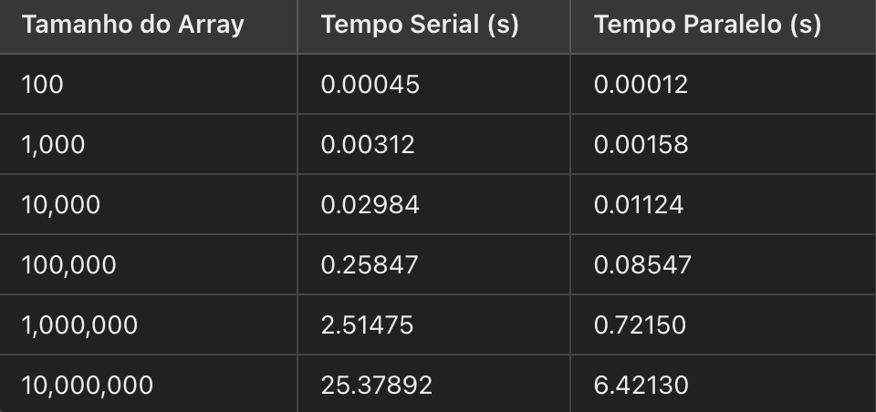

# Descrição Atividade
1)- Considere o algoritmo radix sort:
A) Elabore uma descrição e uma exemplificação para 6 números.
B) Elabore um fluxograma para implementação serial e para paralela.
C) Realize a implementação serial para o seguintes casos: 100,1.000,10.000,100.000,1.000.000,10.000.000
D) Considere a letra c de forma paralizada 
E) Elabore um tabela comparativa.

## Alunos
[Arthur Rodrigues Castilho](https://github.com/ArthurRCastilho) 

### Descrição e Exemplo para 6 Números
Vamos considerar o exemplo de seis números: 329, 457, 657, 839, 436, 720. No Radix Sort, faremos uma ordenação em cada casa decimal (unidades, dezenas, centenas).

Ordenação pelo dígito das unidades:

Sequência: 720, 329, 839, 457, 436, 657
Ordenação pelo dígito das dezenas:

Sequência: 720, 329, 436, 839, 457, 657
Ordenação pelo dígito das centenas:

Sequência final: 329, 436, 457, 657, 720, 839
Ao fim de todas as iterações, a lista está ordenada.

### Fluxogramas
  

### Implementação dos Algoritmos

[radix_sort_serial.ipynb](https://github.com/ArthurRCastilho/Programacao-Paralela/blob/main/atividades/Implementa%C3%A7%C3%A3o%20Radix%20Sort/radix_sort_serial.ipynb)  
[radix_sort_paralizado.ipynb](https://github.com/ArthurRCastilho/Programacao-Paralela/blob/main/atividades/Implementa%C3%A7%C3%A3o%20Radix%20Sort/radix_sort_paralizada.ipynb)  

### Tabela Comparativa

