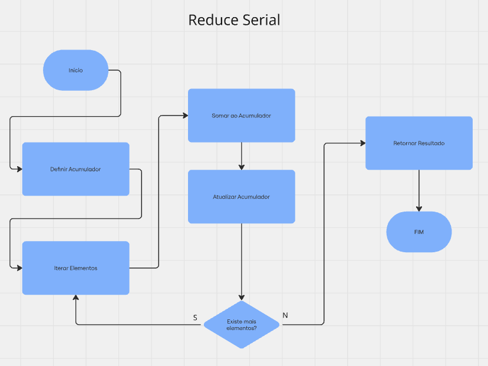
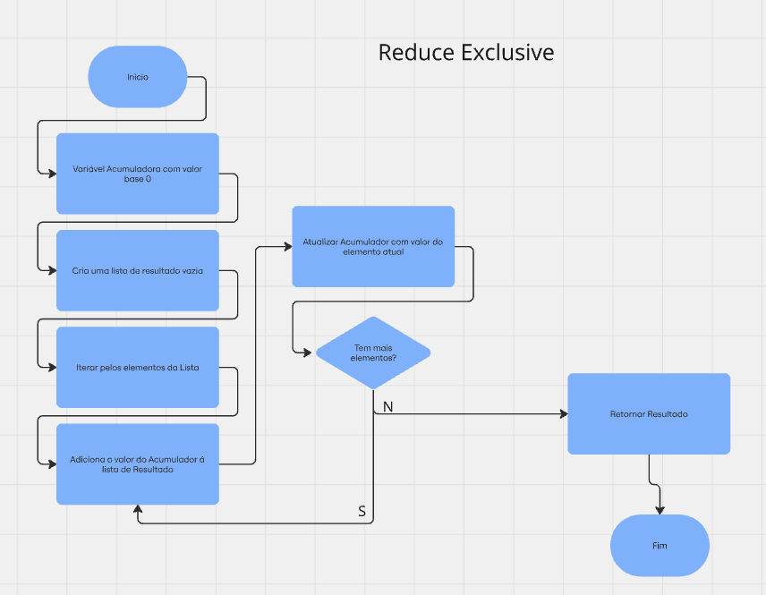
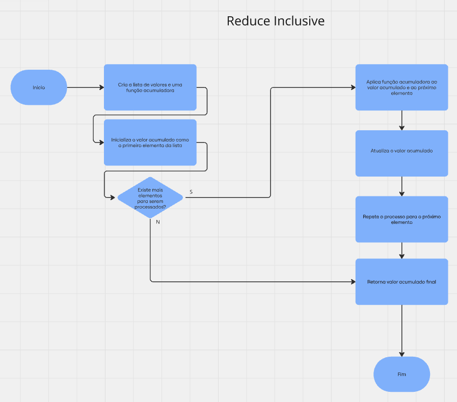
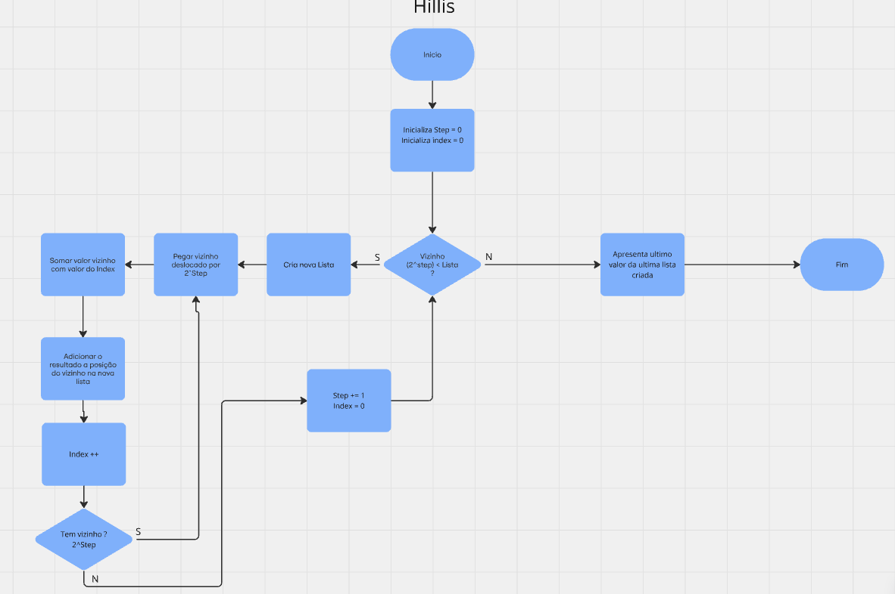
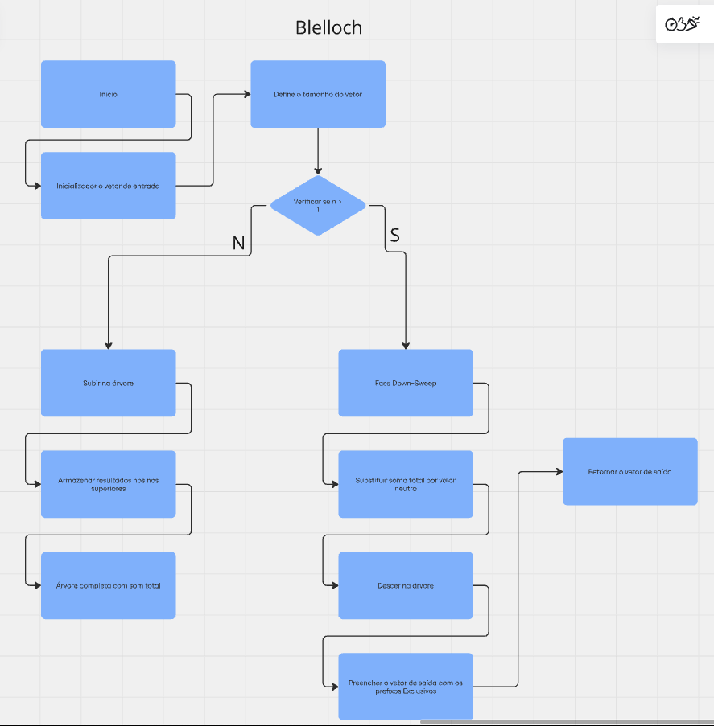

## Fluxogramas
  
  
  
  
  

## Implementação dos Algoritmos

[Reduce Serial](https://github.com/ArthurRCastilho/Programacao-Paralela/blob/main/atividades/Implementa%C3%A7%C3%A3o%20Reduce%2C%20Hills%20e%20Blelloch/letra_b.ipynb)  
[Hillis-Steele](https://github.com/ArthurRCastilho/Programacao-Paralela/blob/main/atividades/Implementa%C3%A7%C3%A3o%20Reduce%2C%20Hills%20e%20Blelloch/letra_c.ipynb)  
[Blelloch](https://github.com/ArthurRCastilho/Programacao-Paralela/blob/main/atividades/Implementa%C3%A7%C3%A3o%20Reduce%2C%20Hills%20e%20Blelloch/letra_d.ipynb)  

## Tabela Comparativa

## Discusão sobre a Atividade

# Descrição Atividade
Considere os seguintes algoritmos para operações de redução em paralelo: Reduce Serial (exclusivo/inclusivo), Hillis-Steele, e Blelloch.

a) Elabore um fluxograma que represente o funcionamento programável de cada um desses algoritmos.

b) Implemente o algoritmo Reduce Serial para diferentes tamanhos de array: 100, 1.000, 10.000, 100.000, 1.000.000 e 10.000.000. Registre os tempos de execução e analise o desempenho conforme o aumento do tamanho do array.

c) Implemente o algoritmo de Hillis-Steele para os mesmos tamanhos de array e registre o tempo de execução, a quantidade de trabalho realizada e o número de etapas (passos) necessárias.

d) Repita o mesmo procedimento para o algoritmo de Blelloch, registrando o tempo, o trabalho e o número de passos para cada tamanho de array.

e) Construa uma tabela comparativa com os resultados obtidos para os três algoritmos, incluindo tempo de execução, quantidade de trabalho e número de passos.

f) Interprete os dados apresentados na tabela e analise as diferenças de desempenho entre os algoritmos, discutindo como o tempo, o trabalho e o número de passos variam conforme o tamanho do array e as características de cada algoritmo.